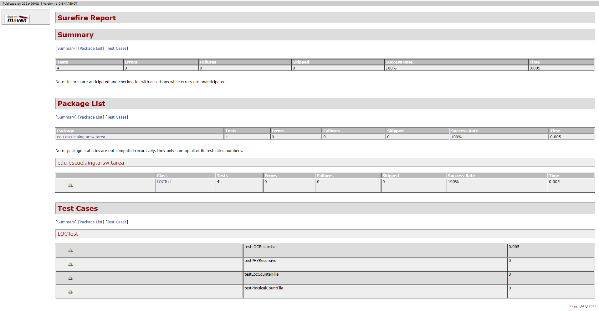
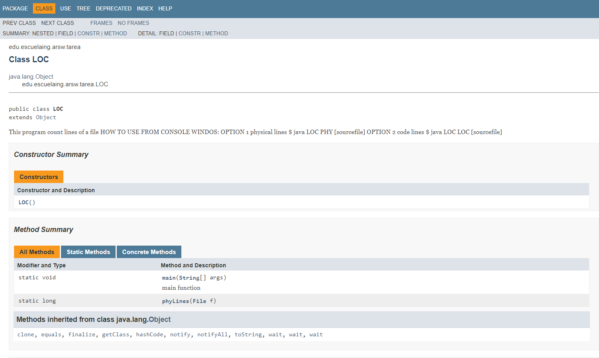
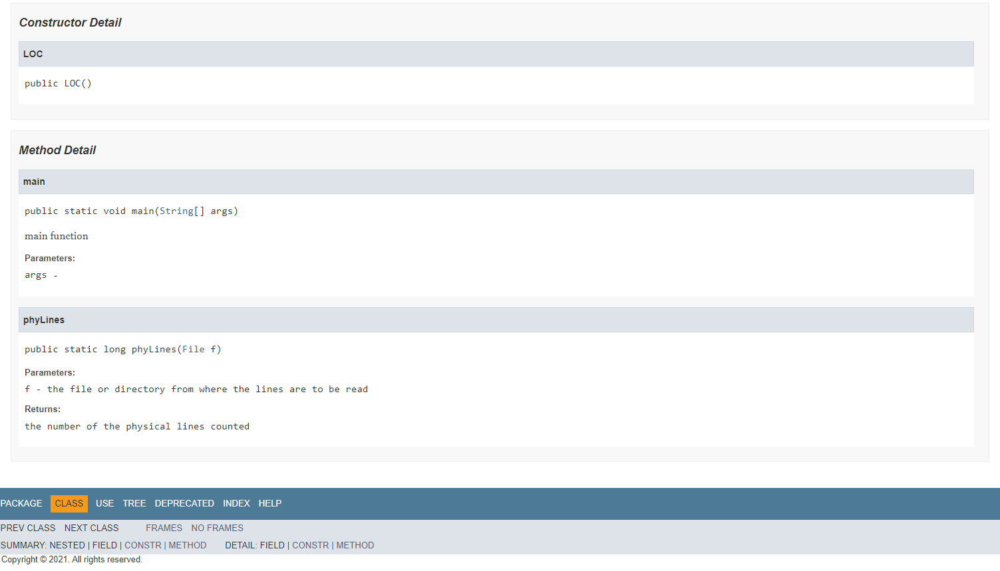

# ARSW
# Autor : Lorenzo Marquez Pinto
# fecha : 02/06/2021
# LOC-Counting Tarea No.1
En esta libreria se tiene un progrma para ver las lineas de codigo de archivos java de manera fisica o solo de codigo para la materia de ARSW de la Escuela Colombiana de Ingenieria
# Pre-Requisitos
Tener java y conocimiento del uso de consola 

#  Ejemplo Modo de uso estando en consola:
~~~ 
  $ java -cp "./target/classes" edu.escuelaing.arsw.tarea.LOC PHY D:\User\Desktop\2021-i\Tareas\Tarea1\LOC_Counting\Resources\PruebaPHY.txt
~~~

# TEST

# JAVA DOC

# Licencia
Este proyecto esta bajo Licencia de uso libre https://github.com/DrLolo03/CNYT/blob/master/LICENSE para mas informacion
